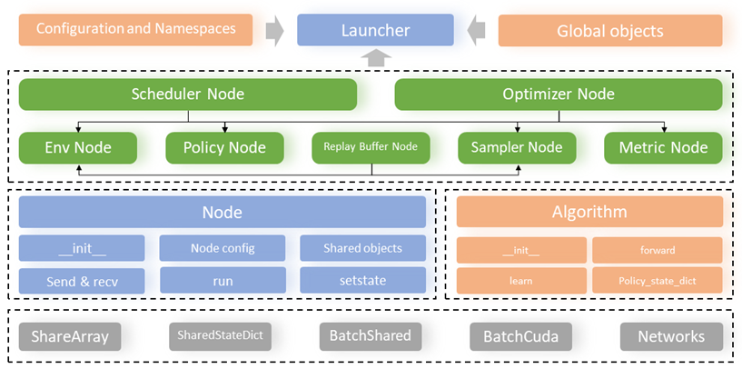
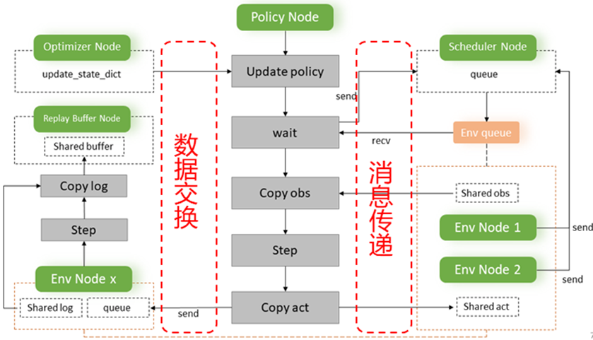

# FastLoop-AD: 基于事件驱动调度的分布式并行加速训练框架及云端工具链

FastLoop-AD 是一个高性能的并行加速强化学习训练框架，通过事件驱动调度、共享内存和分布式计算技术，显著提升强化学习训练效率。

## 🚀 核心特性

- **事件驱动调度器**: 基于管道并行的分布式训练调度
- **共享内存优化**: 无锁数据结构实现高效数据交换
- **分布式环境**: 异步环境交互与数据采集
- **完全分布式**: 支持多进程并行训练

## 📋 目录

- [架构概述](#架构概述)
- [代码结构](#代码结构)
- [核心组件](#核心组件)
  - [1. 事件驱动调度器 (Scheduler)](#1-事件驱动调度器-scheduler)
  - [2. 共享内存与无锁数据结构 (Memory)](#2-共享内存与无锁数据结构-memory)
  - [3. 分布式环境异步交互 (Distributed)](#3-分布式环境异步交互-distributed)

## 🏗️ 架构概述

FastLoop-AD 采用分布式架构设计，通过事件驱动调度器协调多个独立进程中的计算节点，包括环境节点、策略节点和优化器节点，实现高效的并行训练。



## 📂 代码结构

```
FastLoop-AD/
├── fast_core/                    # 核心框架代码
│   ├── __init__.py
│   ├── launcher.py               # 框架启动器，负责初始化和启动各个节点
│   ├── node.py                   # 节点基类，定义所有节点的通用接口
│   ├── scheduler/                # 事件驱动调度器模块
│   ├── memory/                   # 共享内存模块
│   ├── distributed/              # 分布式通信模块
│   ├── algos/                    # 算法实现模块
│   └── utils/                    # 工具模块
├── tests/                        # 测试代码
├── docs/                         # 文档
├── environment.nix.yml           # 环境配置文件
├── LICENSE                       # 开源许可证
└── README.md                     # 项目说明文档
```

### 核心模块说明

- **`launcher.py`**: 框架的主入口，负责解析配置、初始化各个节点并启动分布式训练
- **`node.py`**: 定义了所有节点的基类，包含节点生命周期管理、消息处理等通用功能
- **`scheduler/`**: 事件驱动调度器的核心实现，负责任务调度和资源分配
- **`memory/`**: 共享内存和无锁数据结构的实现，提供高效的数据交换机制
- **`distributed/`**: 分布式通信模块，处理节点间的消息传递和数据同步
- **`algos/`**: 强化学习算法的实现，支持多种RL算法的并行训练
- **`utils/`**: 各种辅助工具，包括可视化、性能监控、通用工具函数等

## 🔧 核心组件

### 1. 事件驱动调度器 (Scheduler)

#### 设计理念
设计了全新的事件驱动调度器对所有独立进程上的模块节点进行统筹调度，实现完全分布式训练。在强化学习的环境交互、数据采集与模型训练过程中，通过利用多个独立的仿真环境（env node）、actor策略（policy node）和优化器节点(optimizer node)来最大程度加速强化学习训练。


#### 核心特性
- **事件驱动机制**: 基于事件触发的异步调度，避免资源空闲
- **管道并行**: 多个节点同时执行不同阶段的计算任务
- **动态负载均衡**: 根据节点负载动态调整任务分配
- **消息队列通信**: 高效的进程间通信机制

#### 工作原理
事件调度器通过整合执行各节点的计算任务，充分利用计算资源。在并行框架的运行时间轴上，多个环境节点与策略节点并行工作，通过消息传递实现数据交换。

### 2. 共享内存与无锁数据结构 (Memory)

#### 设计理念
引入共享内存和无锁数据结构，最大程度减少数据复制与通信开销。在各个节点对象构造的各自的共享对象中，采用共享内存来实现高效的数据共享与低延迟的通信。


#### 核心特性
- **零拷贝数据传输**: 通过共享内存避免数据复制
- **无锁并发**: 使用原子操作和无锁数据结构
- **异步访问**: 支持多节点并发读写访问
- **内存池管理**: 高效的内存分配和回收机制

#### 实现机制
在具体强化学习模型训练过程中，并行加速框架实例化K个优化器节点，异步更新所有actor策略和价值网络。每个优化器节点持有所有策略网络的相同副本，并且包含M个价值网络。在优化器节点、采样器节点、重播缓冲区节点的交互过程中，使用无锁数据结构来提高系统的效率和性能。

#### 无锁重放采样机制
重播缓冲区节点使用无锁重放采样机制，通过无锁数据结构实现对数据的并发访问和修改，避免多个节点同时访问数据时的竞争和阻塞，提高系统的并发性能。

### 3. 分布式环境异步交互 (Distributed)

#### 设计理念
各节点通过共享对象实现更高效的数据交换与消息传递。该框架利用多个环境节点与策略节点进行分布式的环境交互与数据采集，所有的这些环境节点与策略节点都运行在独立的进程中。



#### 核心特性
- **进程隔离**: 每个节点运行在独立进程中，提高稳定性
- **异步交互**: 基于消息队列的异步通信机制
- **数据流水线**: 高效的数据采集、传输和存储流水线
- **容错机制**: 节点故障检测和恢复机制

#### 交互流程
环境节点与策略节点在调度器的统筹下，基于消息队列在节点进程间进行高效的消息传递与交互，并基于各自的共享对象实现高效的数据拷贝与传输。

#### 数据采集机制
交互生成的轨迹数据基于共享对象，异步地收集到重播缓冲区中，供离线策略优化算法使用。这种设计确保了数据采集的高效性和实时性。

## 🎯 使用示例 (基于GOPS训练工具链的加速融合)

自主决策功能训练工具链（GOPS）是面向工业控制的强化学习求解工具包，能够有效地处理高维度、非线性、高动态的复杂工业控制问题。

我们基于GOPS原有架构，实现了全新的并行加速训练架构，该并行架构通过优化进程管理和资源分配机制，显著提升了强化学习训练效率。通过这种集成方式，我们成功地将强大的并行加速能力融入到了原有的训练流程中，使得系统在处理强化学习模型并行训练任务时，能够充分利用计算资源，大幅提升训练效率。具体实现细节请参考[该仓库](https://github.com/zackxiangyu/GOPS/tree/dev-zack)。
